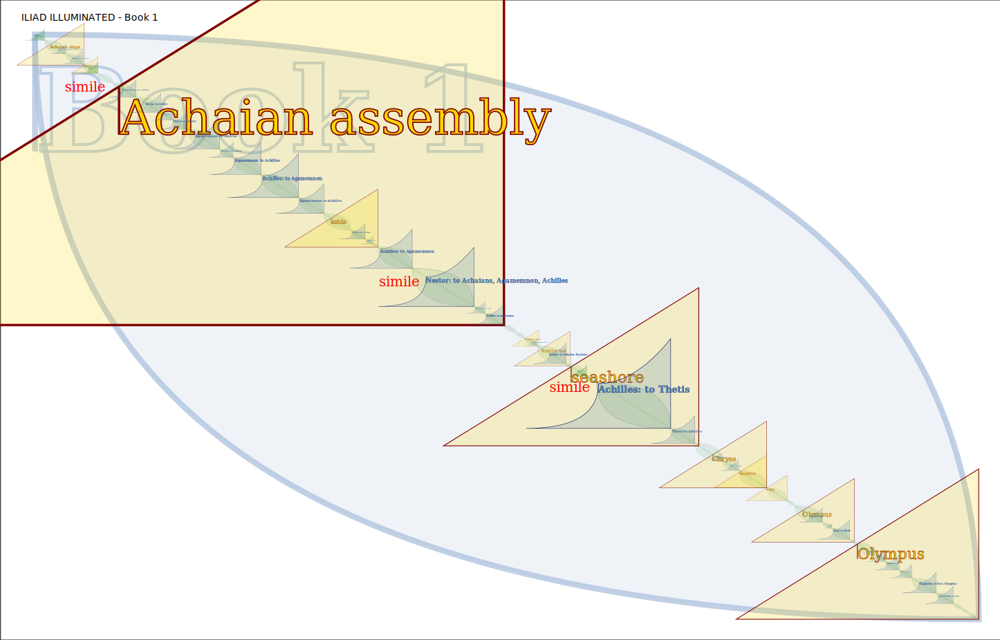
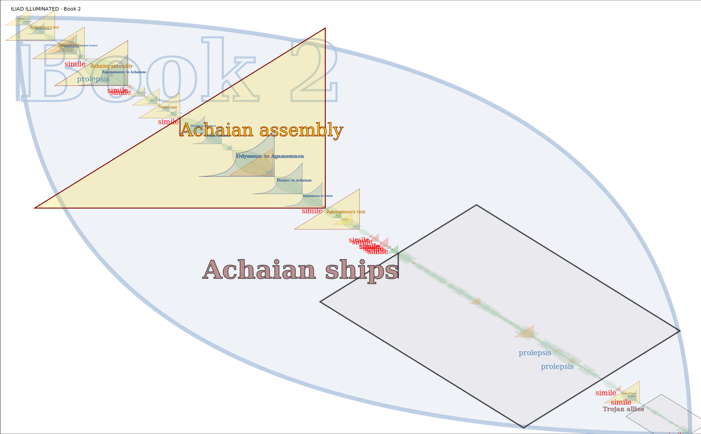

# Iliad Illuminated - Range Maps

SVG images in this folder are generated by the pipeline [PRODUCE-ILIAD-RANGEMAPS.xpl](../../../run/PRODUCE-ILIAD-RANGEMAPS.xpl).

This pipeline can produce range maps for any LMNL but is tailored for MYTHOI markup.

Provide a runtime option `lmnl-dir` to produce SVGs for a different folder inside the `lmnl` folder - or edit the XProc pipeline (`p:directory-list/@path`). By default the pipeline looks in the `edited` folder and processes LMNL documents it finds there.

Each SVG illustrates the relative sizes and positions of ranges in the respective document:

- The course of the book proceeds from upper left (first lines) to lower right (last lines)
- The book is a big blue "lozenge" or leaf shape
- Paragraphs are the same shape, much smaller (zoom in)
- **scene** ranges are gold wedges (triangles), annotated with the scene setting
- **speech** ranges are green 'sails', marked with the speaker and who is spoken to
- **prayer**, **tale** and **simile** ranges are also marked (they are smaller)
  - prayer - invocations to a god or to the Muses
  - tale - a nested narrative
  - simile - likening or comparing
  - prolepsis - looking forward
- lines are marked as well (but you really have to zoom in to see them)
- yes, a unified image showing all 24 books is feasible

The images presented are released under a [CC BY-SA 4.0](https://creativecommons.org/licenses/by-sa/4.0/) license.

Images are available for use under a CC-BY-SA license, with credit:

  - [PerseusDL](https://github.com/PerseusDL) for data sources (canonical TEI markup of Monro and Allen edition)
  - Wendell Piez (EpicMarkup) for markup enhancements and images

But we can also make nicer images: these are just prototypes.

Here we are so far (June 2026):

## Book 1 - Achilles takes offense

See the [source LMNL](../lmnl/edited/book01.lmnl)

## Book 2 - Agamememnon gathers the Achaians

The latter part of Book 2 is given to the Catalog of the Ships listing the Greek navies, with a shorter account of the Trojan allies.

See the [source LMNL](../lmnl/edited/book02.lmnl)

---
20260610
